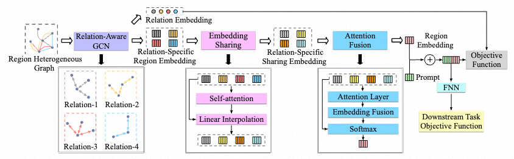
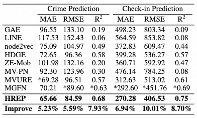

# [AAAI 2023] Heterogeneous Region Embedding with Prompt Learning
**I have been quite busy lately. The dataset and details will be added as soon as possible. If there are any questions, you can send me an email.**

This is a PyTorch implementation of HREP.

Author list: Silin Zhou, Dan He, Lisi Chen, Shuo Shang, and Peng Han.

## Framework

## Experiment

## If you want to reproduce the results, please follow the steps below
### Train
python HRE_Module_Train.py
### Test
python Crime_Prompt.py \
python Check_Prompt.py \
python lud_test.py
